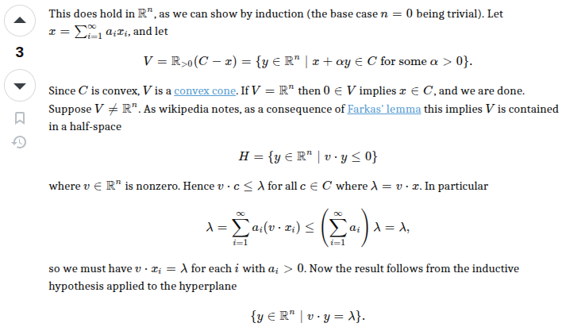

> ch02-04_2025-10-15.pdf 中的证明，凸集关于无穷凸组合封闭，不会证，向鼠神请教。
>
> 鼠神为我讲解了以下证明：
> https://math.stackexchange.com/questions/1973555/how-to-prove-that-a-convex-set-is-closed-under-infinite-convex-combinations?r=SearchResults
>
> 
>
> 1. 这个证明中使用的凸锥的定义和教材上的定义不同。为了方便我把笔记上凸锥的定义改成和维基百科一致的了。
> 2. Farkas' lemma 的本质是，如果一个凸锥是 $\mathbb R^n$ 的真子集，那么一定能找到一个分界面经过原点的半空间包含这个凸锥。
> 3. 证明中借助点乘积 $\lambda$，将点列 $x_i$ 中的所有点以及 $x$ 纳入到了一个维度为 $n-1$ 的空间中（即证明中提到的 hyperplane），因此可以对维数进行数学归纳法。

